# Refonte des onglets de visite — dossier de travail complet (build 661)

> Document de passation. Il rassemble tout ce qui a été analysé, décidé et maquetté pendant la session de revue
> « écran par écran » des onglets de la visite, à partir de l'APK du build 661.
> Rien du code de l'application n'a été modifié : ce dossier ne contient que des analyses, des maquettes HTML,
> des captures, des pictogrammes SVG et des données de référence. La mise en œuvre reste à faire (voir §9).

| Élément | Valeur |
|---|---|
| Build analysé | GitHub Actions « Build Native Android APK », run n°661, lancé à la main le 2026-10-07 à 10:04 UTC, réussi |
| Lien du run | https://github.com/SANS-COLORANT/VISITE-TECHNIQUE/actions/runs/37604925348 |
| Commit du build | `8c8cbafcfaad2d5fbe09d416b2c5d08be71b176a` — « feat(réserves): supprimer les réserves reprises des visites précédentes » |
| Branche du build | `feat/conformite-popup-ns-1c55542` |
| Branche de ce dossier | `claude/peaceful-edison-pno2ys` (construite à partir du commit du build) |
| Maquettes interactives (en ligne) | https://claude.ai/artifact/HBFwnyqwomsAH39JDC1r3R (privé) |
| Catalogue de pictogrammes (en ligne) | https://claude.ai/artifact/GAbq9rRZx5UwPaF56YAdKJ (privé) |
| Fichiers de ce dossier | `README.md` (ce document), `rapport.html` (même contenu, images intégrées), `maquettes/`, `captures/`, `pictos/`, `donnees/`, `outils/` |

## Sommaire

1. [Résumé](#1-résumé)
2. [Contexte, périmètre et règles du projet](#2-contexte-périmètre-et-règles-du-projet)
3. [Méthode et limites](#3-méthode-et-limites)
4. [Principes transverses validés](#4-principes-transverses-validés)
5. [Revue écran par écran](#5-revue-écran-par-écran)
6. [Lecture photo des index (OCR) : diagnostic et plan](#6-lecture-photo-des-index-ocr--diagnostic-et-plan)
7. [Pictogrammes](#7-pictogrammes)
8. [Défauts relevés dans le build 661](#8-défauts-relevés-dans-le-build-661)
9. [Plan de mise en œuvre proposé](#9-plan-de-mise-en-œuvre-proposé)
10. [Journal des échanges et décisions](#10-journal-des-échanges-et-décisions)
11. [Questions encore ouvertes](#11-questions-encore-ouvertes)
12. [Annexes : fichiers, régénération, rappels techniques](#12-annexes)

---

## 1. Résumé

**Objectif demandé** : passer en revue tous les onglets des parties « visite » pour les améliorer, écran par écran,
en échangeant sur chacun. Priorités fixées : **gagner de la hauteur d'écran**, **simplifier au maximum pour un effet
premium** tout en gardant la possibilité de tout modifier, et **accélérer la saisie sur le terrain**.

**Ce qui a été fait** : lecture du code du build 661, puis neuf écrans traités un par un avec une maquette HTML
interactive « avant / après » (colonne de gauche = écran actuel reconstitué d'après le code, colonne de droite =
proposition). Chaque écran a été validé par le porteur du projet, souvent avec des ajustements (§10).

**Gains mesurés sur les maquettes** (longueur de l'onglet en « écrans » de défilement, sections dépliées ; mesures
faites sur la maquette, pas sur un téléphone réel) :

| Écran | Avant | Après | Remarque |
|---|---|---|---|
| Coque (zone de saisie visible) | 52 % de l'écran | 73 % | en-tête, carte d'avancement, bandeau photos de référence et barre du bas condensés |
| 2 Distribution | 4,5 écrans | 4,2 écrans | les pictogrammes et sous-groupes ajoutent de la hauteur ; les groupes fermés compensent |
| 3 Régulation | 4,1 | 2,4 | réseaux repliables, températures côte à côte |
| 4 Relevés | 5,7 | 2,8 (3,2 avec températures ajoutées) | compteurs sur deux lignes |
| 5 Conformité · Local | 10,8 | 5,9 | une ligne par contrôle au lieu d'une carte |
| 6 Équipements | 2,7 | 1,4 | une ligne par équipement |
| 7 Réserves | 3,8 | 2,0 | regroupement par onglet d'origine, fiche en fenêtre |
| 8 Photos | 3,1 | 2,3 | trois colonnes, légendes |

L'écran 1 (Informations) n'est pas mesuré : sa colonne « avant » est incomplète dans la maquette.

**Ce qui reste à faire** : (1) la correction de la lecture photo des index (OCR), demandée « après les maquettes » ;
(2) la mise en œuvre dans le code, par lots, avec les tests prévus par `agents/qa.md` ; (3) l'intégration des
151 pictogrammes dans `MetraCvcIcons.js`.

---

## 2. Contexte, périmètre et règles du projet

### 2.1 L'application

Application mobile **METRA** (Expo 51 / React Native 0.74 / SQLite via `expo-sqlite`), hors connexion, pour des
visites techniques de chaufferies et de réseaux. Quatre **trames** de visite (registre `trameRegistry.js`) :

| Trame | Identifiant | Onglets (ordre) |
|---|---|---|
| ICPE | `icpe_v1` | Informations, Distribution, Régulation, Relevés · Conf. Local, Conf. Énergie, Conf. Chauffage, Conf. ECS, Conf. Adoucisseur · Équipements, Réserves, Photos |
| Réseau de chaleur | `reseau_chaleur_v1` | Informations, Distribution, Relevés, Régulation · Conf. Chauffage, Conf. ECS, Conf. Adoucisseur, Conf. Énergie, Conf. Local · Équipements, Réserves, Photos (périmètre Primaire / Secondaire) |
| VMC | `vmc` | Informations, Caisson 1 à 6 · Équipements, Réserves, Photos |
| Pré-allumage | `pre_allumage` | Informations, Installations, Conclusion · Équipements, Réserves, Photos (les onglets Compteurs, Régulation, Chaufferie, Sous-stations existent mais sont regroupés dans « Installations ») |

### 2.2 Règles de `AGENTS.md` à respecter lors de la mise en œuvre

(version relue au redémarrage de la session ; elle remplace une première version centrée sur la politique Context7)

1. Patrimoine partagé, informations techniques maillées par concepts canoniques entre trames d'un même local ; chaque valeur garde sa provenance de visite.
2. Les réserves non levées suivent le local entre trames jusqu'à leur levée ou annulation ; photos et conclusions restent historiques.
3. Équipements patrimoniaux partagés mais filtrés selon l'applicabilité de la trame.
4. Les contrôles restent définis par trame ; un concept équivalent peut recevoir la dernière valeur connue d'une autre trame.
5. **Un avis satisfaisant peut et doit proposer un commentaire positif.**
6. Une nouvelle visite ICPE, VMC ou Réseau de chaleur reprend par défaut les dernières valeurs compatibles du même local (champs, mesures, réseaux/compteurs, avis, commentaires, réserves non levées), modifiables. Pré-allumage ne reprend que les informations durables.
7. **L'application doit rester utilisable hors connexion.**
8. Une modification d'une trame ne doit pas casser les autres.
9. Missions : strictement indépendant de l'Intranet, désactivé par défaut (verrou LAB).
10. Une visite Mission peut rester partielle et se reprendre sans perte.
11. Développer sur une branche dédiée et ouvrir une **PR vers `native-android`**.
12. **Un bundle JavaScript réussi n'est pas une compilation Android réussie.**
13. Ne jamais ajouter dans `postinstall` ou la CI un patch qui modifie silencieusement une fonctionnalité : modifier le vrai fichier source et son contrat de validation.

Références obligatoires : `docs/METRA_RULES.md`, `DATA_MODEL.md`, `TRAMES.md`, `REPORTS.md`, `ANDROID_ARCHITECTURE.md`,
`MISSIONS.md`, et `docs/DESIGN_SYSTEM.md` (direction artistique **« Verre chaud »**, validée le 25/09/2026).

### 2.3 Direction artistique « Verre chaud » (extraits utiles ici)

- Fond crème `#F3F1EC`, deux halos orange en dégradé radial (`AmbientBackground` : haut-droite 30 % d'opacité, gauche-milieu 14 %).
- Surfaces en verre : le vrai flou natif (`GlassCard` : `BlurView` 18 + voile blanc 45 %) est réservé aux éléments phares (carte d'avancement) ; les cartes de saisie sont en **blanc chaud opaque `#FDFCFA`**, bordure `rgba(22,21,15,0.08)`, ombre à deux niveaux.
- Accent en dégradé `#F26426 → #D9531A` ; puce choisie = **orange plein** ; boutons principaux = pilule orange lumineuse (`ButtonGlow`).
- Icônes : `CvcIcon` dessinées (`MetraCvcIcons.js`), posées dans `IconOrb` ; **jamais d'emoji ni de caractère texte comme icône**.
- Typographies : Sora (titres, chiffres), Inter (texte) via `FONTS`.
- Android : **jamais d'`elevation` sur un fond translucide** ; surface avec ombre = `#FDFCFA` opaque.
- `ProgressRing` pour toute progression ; `StepperNumerique` (boutons − / + de 52 px).

---

## 3. Méthode et limites

- **Lecture du code** du build 661 (commit `8c8cbaf`). Fichiers principaux lus : `VisiteScreen.js` (919 lignes), `VisitChrome.js`, `TrameGenericPanel.js`, `DurableChampGenerique.js`, `GenericFields.js`, `PersistentControleGenerique.js`, `OptimizedRegulationPanel.js`, `OptimizedRelevesPanel.js`, `GuidedEquipmentPanel.js`, `OptimizedRemarksPanel.js`, `OptimizedPhotoPanel.js`, `PhotoOcrReview.js`, `photoModeData.js`, `MetraOcrModule.kt`, `trameRegistry.js`, `data.js`, `reseauChaleurTrame.js`, `vmcTrame.js`, `preAllumageTrame.js`, `styles.js`, `premiumChrome.js`, `reserveSeverity.js`, `terrainVisitDb.js`.
- **Aucune exécution de l'APK** : l'environnement n'a pas permis de lancer l'application. La colonne « avant » des maquettes est donc **reconstituée d'après le code** ; elle peut différer de l'écran réel sur des détails (marges, polices). Le porteur du projet a confirmé que le fond réel est « en verre opaque » : les maquettes ont été corrigées en conséquence (halos orange, carte d'avancement en verre dépoli, cartes de champs opaques, puces choisies en orange plein).
- **Maquettes** : une seule page HTML autonome (`maquettes/maquettes-visite.html`), un onglet par écran, deux téléphones côte à côte. Les maquettes sont **interactives** (replier, cocher, saisir, ouvrir les fiches) mais ne sont pas le code de l'application.
- **Mesures** : la « longueur d'onglet » est `hauteur du contenu / hauteur visible` mesurée dans la maquette, sections dépliées. C'est un ordre de grandeur, pas une mesure sur appareil. Dans `captures/*-complet.jpg`, les chiffres « zone de saisie » et « onglet complet » affichés sous les téléphones ne sont **pas significatifs** (les téléphones y sont étirés à la hauteur du contenu) : se référer au tableau du §1.
- **Context7** : non utilisé (aucune API externe incertaine ; budget de 5 consultations respecté).
- **Données d'exemple** : les noms de sites, équipements, valeurs d'index, réserves et photos des maquettes sont des **exemples**. Seules viennent des données réelles : la liste des 104 contrôles de conformité (`donnees/conformite-trame-icpe.json`, extrait de `data.js`), quelques causes de réserve (Ventilation basse, Issue de secours, Extincteurs) et les options des listes de choix.

---

## 4. Principes transverses validés

Ces principes reviennent sur tous les écrans ; ils sont à implémenter une fois comme composants partagés (§9, lot 0).

1. **Section = carte à bannière** : pictogramme sur pastille (`IconOrb`), titre, avancement « x / y » (et « n N.S »), éventuel bouton d'action (« Tout en S », « + Ajouter », « Idem chauffage »), flèche d'état. **Toucher le nom replie ou déplie** la section.
2. **Tout est fermé au départ** sur tous les onglets ; on ouvre manuellement. Exceptions voulues : sur Conformité et Photos, un filtre actif (« À faire », « N.S », une origine) ouvre automatiquement ce qu'il faut afficher.
3. **Paramètre à choix : il se referme sur la valeur choisie** (pastille orange, bleu-vert pour l'eau). Toucher la ligne la rouvre : on retouche la valeur pour la retirer ou on en choisit une autre. **Choix multiples** : le paramètre reste ouvert jusqu'au bouton « OK ». Les listes gardent « + Autre » (saisie libre).
4. **Noms et unités modifiables partout** : noms de compteurs, de mesures, de pressions, de groupes (Primaire, Chauffage, ECS…), de réseaux (crayon) ; unité d'un compteur modifiable d'un toucher (m³, L, MWh, kWh, bar, %). Renommer ne change que le nom à l'écran, **pas la ligne du rapport Excel** (comme pour les compteurs : `destination` figée).
5. **Valeurs numériques en tuiles** : − / + de part et d'autre d'un chiffre lisible, deux tuiles côte à côte quand elles vont ensemble (T°ext / T°dép, Départ / Retour, Pression chauffage / ECS) ; **le premier « + » part d'une valeur utile** (dernière valeur connue, sinon valeur courante) au lieu de 0. Le toucher sur le chiffre garde la saisie au clavier.
6. **Actions destructrices : toujours une confirmation**, et un message « Annuler » après les actions groupées (« Tout en S », « Tout présent », suppression de photo, suppression des réserves reprises).
7. **Édition dans une fenêtre (feuille du bas)** plutôt que dans la liste : fiche N.S, fiche équipement, fiche réserve, visionneuse photo.
8. **Pas de texte technique visible**, pas de glyphe texte à la place d'une icône.
9. **Couleurs sémantiques** : vert (conforme / levée / présent), rouge (N.S), ambre (alerte), bleu-vert pour tout ce qui touche à l'eau (exception à l'accent orange, à valider, déjà utilisée par Missions en vert).
10. **Pictogramme dédié** pour chaque onglet, rubrique, type et statut (§7).

---

## 5. Revue écran par écran

Chaque sous-section : état du build 661 (avec fichiers), constats, proposition, décisions du porteur du projet,
impact code et points d'attention. Les captures sont dans `captures/` ; chaque écran a une vue `…-defaut.jpg`
(état à l'ouverture, sections fermées) et `…-complet.jpg` (tout déplié, avant à gauche / après à droite).

### 5.0 Coque commune (en-tête, avancement, onglets, barre du bas)

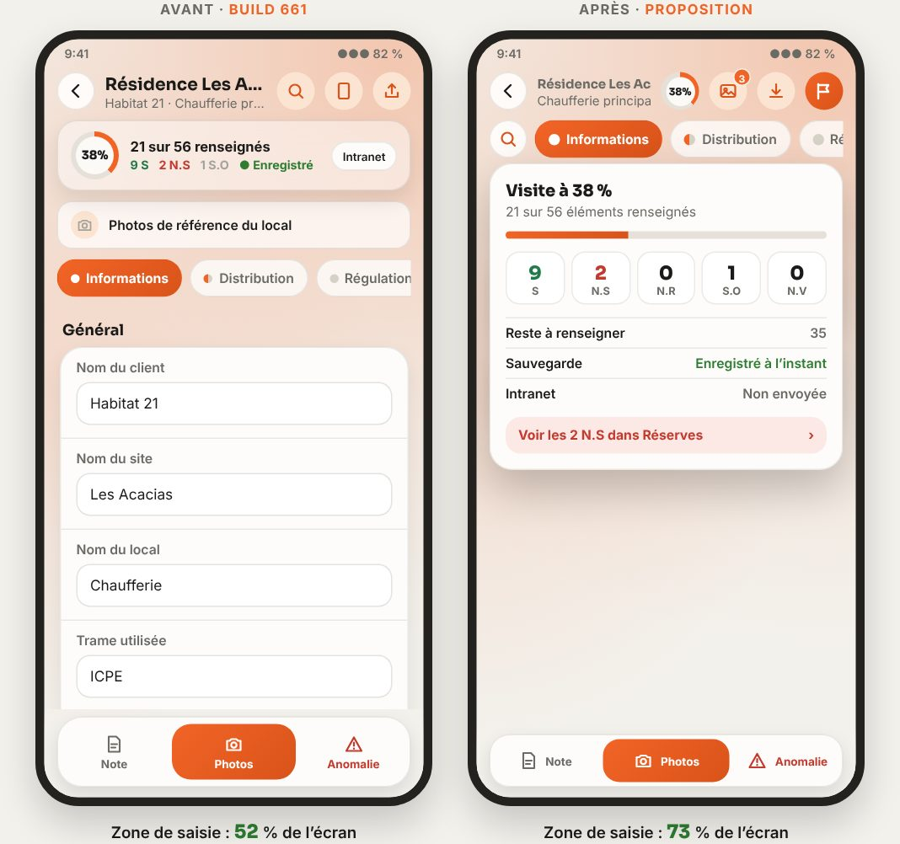

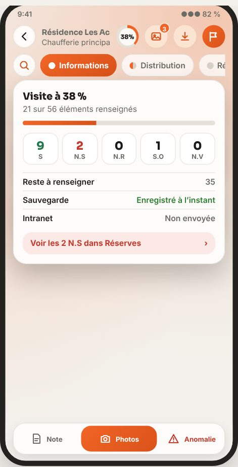

**Build 661** (`VisiteScreen.js`, `VisitChrome.js`) — cinq blocs empilés avant le contenu :
1. en-tête : retour, `nom_site`, sous-titre (client · installation · trame · « Mode Express »), puis boutons ronds **sans libellé** : recherche, compagnon tablette (si ≥ 600 dp), export document (Pré-allumage seulement), « Terminer » (icône d'export : aperçu, signature, export Excel) ;
2. carte d'avancement `GlassCard` : `ProgressRing`, « x sur y renseignés », compteurs S · N.S · S.O, état de sauvegarde, contrôle de synchro Intranet (ou pastille « À rattacher ») ; elle ne se réduit qu'en la touchant (`heroMini`), sans indice visible ;
3. bandeau `PhotoReferenceAccess` (photos de référence du local) ;
4. `SectionRail` : 12 à 14 puces défilantes avec point d'état de 8 px (vide, entamé, terminé, alerte) ; en mode tablette (≥ 900 dp) `SideSectionList` à gauche ;
5. `VisitActionBar` en bas : Note, Photos (Mode Photo), Anomalie.
Autres éléments : swipe entre onglets (`PanResponder` + `Animated`), mémoire de l'onglet actif (`navigationMemory`), option « onglets en bas », sommaire `VisitSpaces` (parcours terrain), fenêtres Note libre et Anomalie (Périmètre obligatoire en Réseau de chaleur).

**Constats** : beaucoup de hauteur perdue sur téléphone ; boutons sans libellé (« Terminer » = icône d'export) ; point d'état trop petit en plein soleil ; trois accès à la saisie d'anomalie (barre du bas, recherche, onglet Réserves).

**Proposition validée** :
- une seule ligne d'en-tête, **uniquement des pictogrammes** : retour, titre, **jauge** (30 px), **photos de référence** (pictogramme image avec pastille de comptage), **télécharger** (export direct), **terminer** (drapeau orange : aperçu, signature, export) ;
- la **recherche** passe au début du rail d'onglets ;
- **toucher la jauge** ouvre une fenêtre d'état : pourcentage, « 21 sur 56 éléments renseignés », nombre de **S, N.S, N.R, S.O, N.V**, reste à renseigner, état de sauvegarde, état d'envoi Intranet, raccourci « Voir les 2 N.S dans Réserves » ;
- **nom du site et du local toujours visibles** : site sur la première ligne, local · client · trame sur la seconde, **qui défile doucement** quand le texte est trop long (sans animation si l'accessibilité le demande) ;
- point d'état agrandi (9 px) ; barre du bas plus fine (icône et libellé sur une ligne) ; le fond reprend les halos orange et la carte en verre dépoli.
- Zone de saisie visible : 52 % → 73 %.

**Impact code** : `VisiteScreen.js` (en-tête, hero → jauge + feuille d'état), `VisitChrome.js` (`SectionRail` : recherche en tête, point d'état, `VisitActionBar`), `PhotoReferenceAccess`, `visitTabStatusDb.js` (compteurs déjà disponibles : `tabStatus.avis`, `tabStatus.tabs`). **Points d'attention** : conserver les modes tablette et « onglets en bas » ; marquee = animation désactivée en `reduceMotion`.

### 5.1 Informations


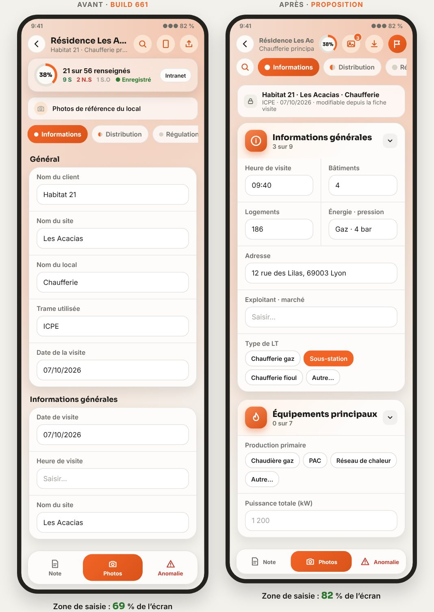

**Build 661** (`TrameGenericPanel.js` → `TrameGenericStaticPanel`, `DurableChampGenerique.js`, `data.js` clé `p-infos`) — ICPE : trois sections de champs texte « Saisir… » :
- « Général » : Nom du client, Nom du site, Nom du local, Trame utilisée, Date de la visite ;
- « Informations générales » : Date de visite, Heure de visite, Nom du site, Adresse, Nbr de bât / lgt, Energie - pression, Exploitant - marché, Type de LT ;
- « Description des principaux équipements » : Production primaire, Nb d'équipements, Puissance totale installée (kW), Type de régulation, Production ECS, Puissance/volume/nb de plaques…, Nb d'équipements (ECS).
Listes de choix (`FIELD_OPTIONS`) : Production primaire, Type de LT, Type de régulation, Production ECS, avec « + Autre » (`ChipSelector`). Champs numériques (`getNumericConfig`) : `(kW)` → stepper 0–2000 pas 10 ; `Nb …` → 0–50. Date de visite : masque JJ/MM/AAAA, valeur du jour par défaut. Un bouton photo sur chaque champ, sauf dans les sections `infos.g_n_ral`, `infos.informations_g_n_rales`, `vmc-infos…`. En Réseau de chaleur : pas de section « Général » ; « Informations générales » contient Sous-Station(s) desservis.

**Constats** : *doublons probables en ICPE* (Nom du site et la date de visite apparaissent dans « Général » et dans « Informations générales », sous deux clés de date différentes) — **à confirmer sur l'APK, le porteur du projet n'a pas encore répondu** ; client, site, local, trame et date sont déjà connus à la création ; « Nbr de bât / lgt » est un champ libre alors que ce sont deux nombres ; boutons photo inutiles sur des champs administratifs ; aucun repère obligatoire / facultatif.

**Proposition** : bandeau **« Visite »** en lecture seule (client · site · local · trame · date, modifiable depuis la fiche visite) à la place du bloc « Général » ; suppression des doublons ; champs courts côte à côte (heure, bâtiments, logements, énergie · pression) ; **Bâtiments / Logements en deux champs numériques** ; listes de choix conservées avec « + Autre » ; puissance en saisie directe (clavier numérique, unité en suffixe) ; retrait des boutons photo des champs administratifs ; deux cartes à bannière repliables (« Informations générales », « Équipements principaux »).
**Impact code / attention** : champs et clés **inchangés** (mapping Excel `EXCEL_ROWS`, maillage `trameSemanticMesh`, `carryForward`) ; l'affichage « bandeau » doit lire les valeurs existantes ; deux champs numériques → conserver la clé unique « Nbr de bât / lgt » (stockage « 4 / 186 ») pour l'export.

### 5.2 Distribution

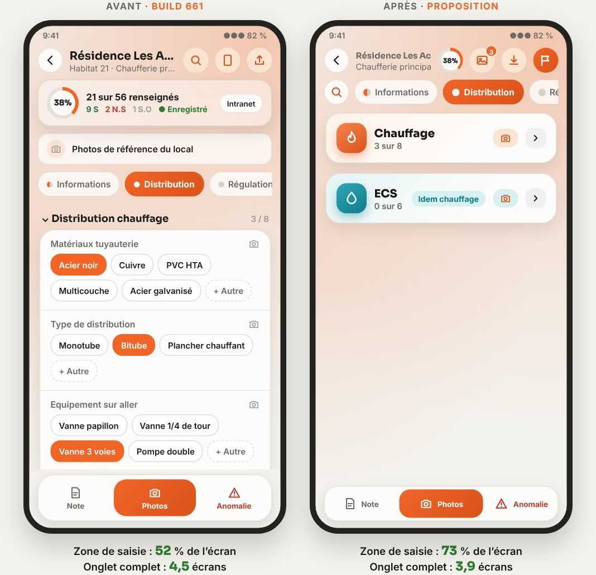
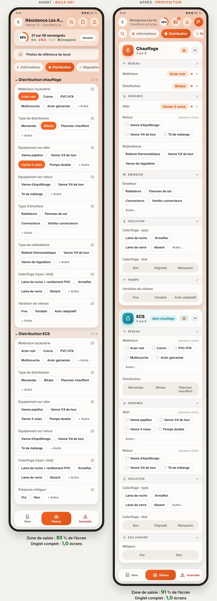

**Build 661** (`data.js` `p-distrib`) — deux sections : « Distribution chauffage » (8 champs : Matériaux tuyauterie, Type de distribution, Equipement sur aller, Equipement sur retour, Type d'émetteur, Type de robinetterie, Calorifuge (type / état), Variation de vitesse) et « Distribution ECS » (6 champs : Matériaux, Type, Aller, Retour, Calorifuge, Présence mitigeur). Tous en listes de choix (`FIELD_OPTIONS`), toutes les puces visibles sur 2 lignes + « + Autre » + un bouton photo par champ. Environ 4,5 écrans.

**Proposition validée** (version « premium » demandée) :
- **bannière par section** avec pictogramme sur pastille dégradée : flamme orange (chauffage), goutte **bleu-vert** (ECS), avancement « 3 sur 8 », accès photo unique de section (remplace 14 boutons) ;
- **sous-groupes** avec pictogramme (affichage seulement, mêmes champs et clés) : Réseau (matériaux, distribution), Organes (aller, retour, robinetterie), Émission (émetteur), Isolation (calorifuge), Pompe (variation de vitesse) ; noms de groupes renommables ;
- **trois présentations selon le champ** pour casser la monotonie : ligne compacte quand une valeur est reprise (point orange = valeur reprise de la visite précédente) ; **interrupteur à segments** pour 2–3 choix courts (type de distribution, variation de vitesse, mitigeur) ; **puces cochables** quand plusieurs réponses sont possibles (matériaux, aller, retour — valeur stockée en texte, l'export Excel ne change pas) ;
- **sélection puis repli** sur la valeur (pastille orange / bleu-vert), rouverture au toucher, désélection par retouche ; multi-choix avec « OK » ;
- **Calorifuge en deux temps** (type puis état Bon / Dégradé / Manquant — *états à ajuster*) ;
- **« Idem chauffage »** dans la bannière ECS : copie matériaux, distribution, aller, retour, calorifuge (modifiables) ;
- libellés raccourcis (« Aller » au lieu de « Equipement sur aller »), clés internes inchangées ;
- tout fermé au départ.
**Questions ouvertes** : photos par champ utilisées ? points orange « repris » ou neutres ? valeurs manquantes dans les listes (matériaux, équipements, émetteurs) ? **Impact code** : `TrameGenericPanel.js`/`DurableChampGenerique.js` (mode « choix repliable »), composant de sous-groupes, fusion calorifuge type + état dans la **même clé** « Calorifuge (type / état) » (format « Type – État »).

### 5.3 Régulation

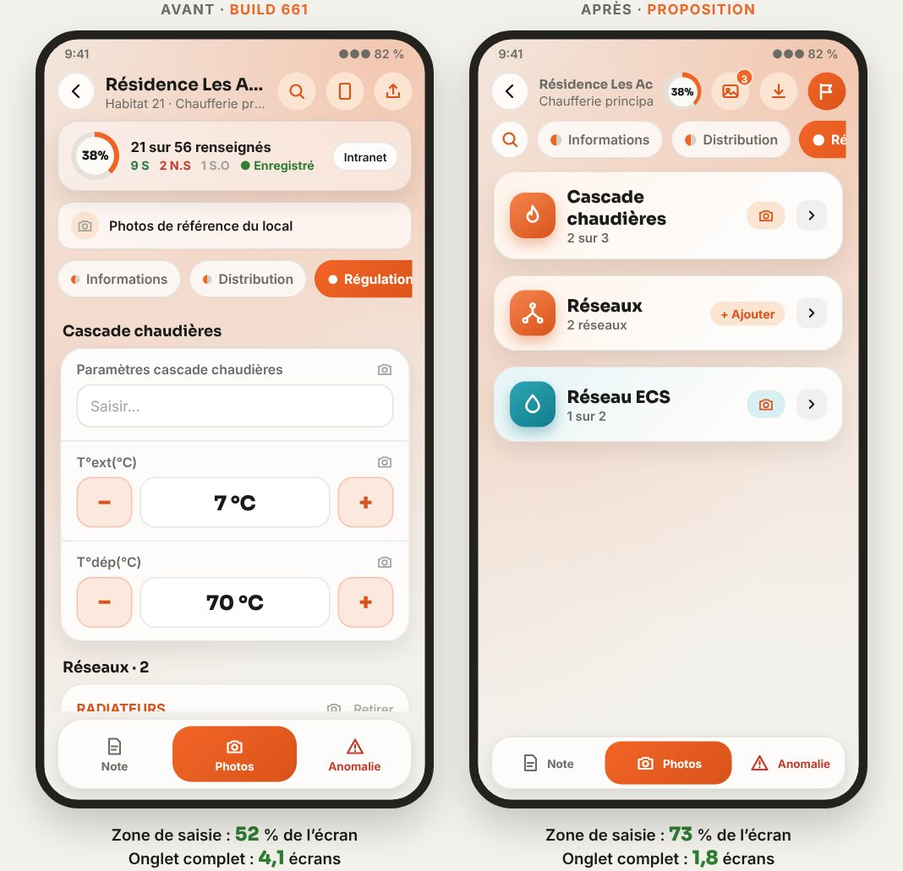
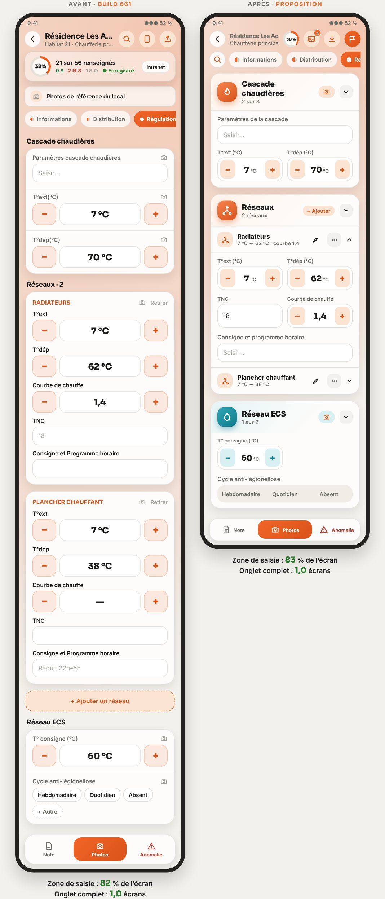
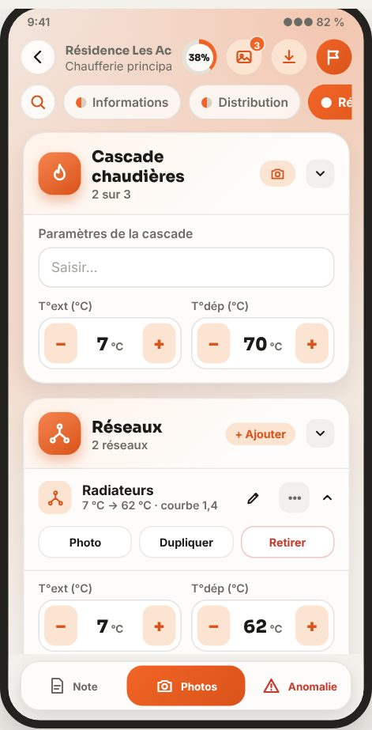

**Build 661** (`OptimizedRegulationPanel.js`) : « Cascade chaudières » (champ texte + T°ext + T°dép en steppers), une `ReseauCard` par réseau (nom en majuscules orange, bouton photo, lien « Retirer », puis T°ext, T°dép, Courbe de chauffe en steppers pleine largeur, TNC et « Consigne et Programme horaire » en texte) — jusqu'à 6 réseaux en ICPE (`RESEAU_TEMPLATE`, colonnes `reseaux`) — puis « Réseau ECS » (T° consigne stepper + cycle anti-légionellose en puces). Environ 4,1 écrans pour 2 réseaux.

**Défauts** : **un champ vide démarre à 0** (pour 62 °C : 62 appuis ou passage au clavier) ; **« Retirer » supprime le réseau sans confirmation** (`supprimerReseau` direct) ; une carte de réseau ≈ un écran, même remplie.

**Proposition validée** : T°ext et T°dép **côte à côte** en tuiles ; **valeur de départ utile** (dernière valeur connue, sinon 7 °C / 60 °C / courbe 1,0 / consigne ECS 60 °C — *valeurs à valider*) ; **réseaux repliables** avec résumé (« 7 °C → 62 °C · courbe 1,4 ») ; menu « ⋯ » par réseau : **Photo, Dupliquer (nouveau), Retirer (avec confirmation)** ; nom de réseau renommable (crayon) ; bannières flamme / réseau / goutte bleu-vert ; cycle anti-légionellose qui se replie sur sa valeur. 4,1 → 2,4 écrans.
**Questions ouvertes** : valeurs de départ ? réseaux d'un même site souvent presque identiques (utilité de « Dupliquer ») ? programme horaire toujours libre ou cas types (réduit nuit, week-end) ? **Impact code** : `OptimizedRegulationPanel.js` ; `dupliquerReseau` à créer (`db.js`) ; conserver `reseau_site_id` (réseaux persistants) ; confirmation de suppression.

### 5.4 Relevés

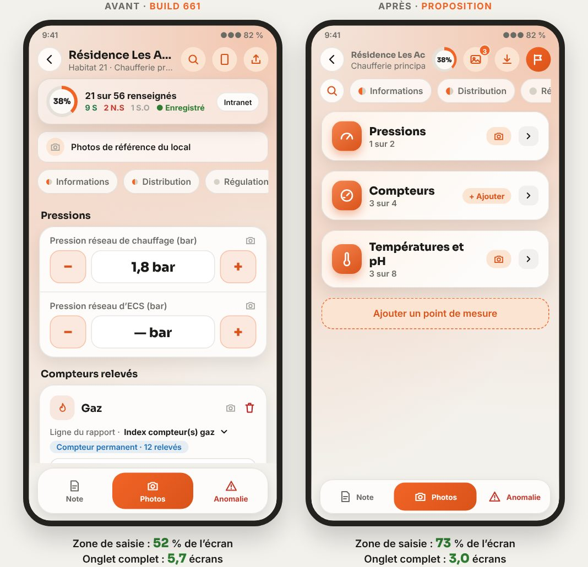
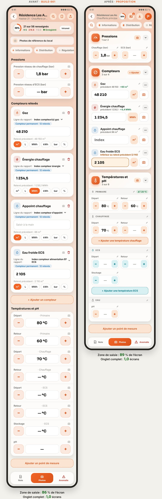
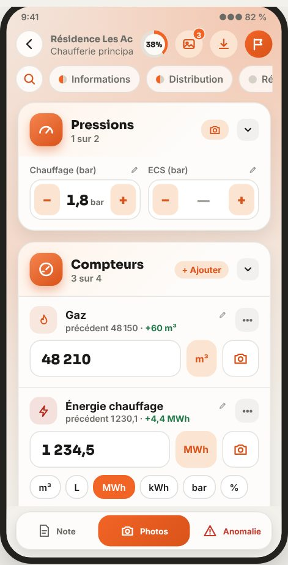

**Build 661** (`OptimizedRelevesPanel.js`, `relevePictos.js`, `meterDestinations.js`) : « Pressions » (2 champs en stepper 0–6 bar pas 0,1 + lecture photo), « Compteurs relevés » (4 compteurs semés depuis les champs « Index … » ; `CompteurCard` par compteur : pictogramme + nom court cliquable pour renommer, lecture photo OCR, corbeille avec confirmation, **« Ligne du rapport · … ⌄ »**, badge « Compteur permanent · n relevés », index en saisie manuelle, « Relevé précédent », message de contrôle d'index (`controlerIndex`), **6 puces d'unité** m³ L MWh kWh bar % ; ≈ 230 px par carte), « + Ajouter un compteur » (fenêtre : 12 types + autre, ligne du rapport), « Températures et pH » (8 champs groupés par circuit en steppers 0–100), « Ajouter un point de mesure » (`ExtraMeasurementCard`, table `points_mesure_visite`, annexe Excel). Environ 5,7 écrans. En Réseau de chaleur, les températures sont des **contrôles avec avis** (`PersistentControleGenerique`).

**Proposition validée** :
- **compteur sur deux lignes (≈ 90 px)** : nom (renommable) + résumé « précédent 48 150 m³ · **+60 m³** », index en gros, **unité = une seule pastille cliquable** (liste m³ L MWh kWh bar %), caméra de lecture, menu « ⋯ » (Photo, Ligne du rapport, Retirer avec confirmation « ne sera plus proposé aux prochaines visites ») ; **consommation depuis le relevé précédent en direct**, champ ambre si l'index est inférieur au précédent (contrôle existant rendu visible) ; alerte conservée si deux compteurs occupent la même ligne (envoi Intranet bloqué) ;
- **températures par circuit** (Primaire, Chauffage, ECS, Eau/pH), Départ et Retour côte à côte, **ΔT calculé** (nouveau repère) ; premier « + » à valeur utile ;
- **tous les noms renommables** (compteurs, températures, pressions, pH, groupes) — nom d'affichage seulement ;
- **ajout de températures de chauffage et d'ECS** : « + Ajouter une température chauffage / ECS » ; noms proposés (Départ 2, Retour 2, Mélange ; Ballon bas, Ballon haut, Bouclage), renommables, retrait avec « Retirer ? Oui / Non » ; stockage via le mécanisme existant des **points de mesure** (annexe « mesures complémentaires » de l'Excel, pas les lignes fixes) ;
- **unités modifiables** d'un toucher (compteurs) ;
- pressions côte à côte ; sections repliables, fermées au départ ; bannières manomètre / compteur / thermomètre.
**Questions ouvertes** : ΔT utile ? unité par défaut déduite du type de compteur (modifiable) ? température de départ à 60 °C ou dernière valeur seulement ? températures ajoutées : annexe suffisante ou rattachement à une ligne du rapport ? températures complémentaires à proposer d'emblée ? **Impact code / attention** : `destination` figée avant tout renommage (déjà fait pour les compteurs) à étendre aux mesures ; trame Réseau de chaleur : températures = contrôles avec avis (cas à traiter à part) ; `excelExport.js` ligne 282 (`points_mesure_visite`).

**Lecture photo (OCR)** : voir §6 — le porteur du projet a testé et constaté que la lecture prenait les autres informations du compteur au lieu de l'index. Une simulation du flux guidé est dans la maquette (caméra d'un compteur).

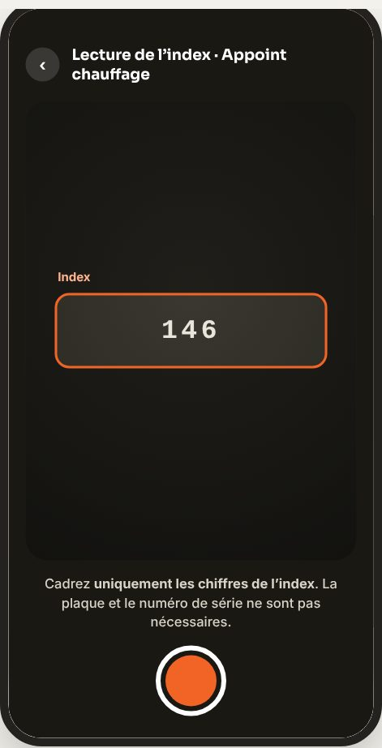
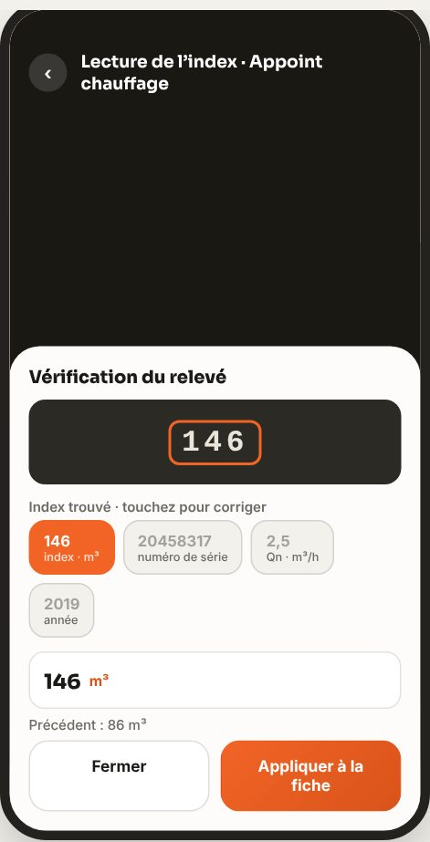

### 5.5 Conformité (Local, Énergie, Chauffage, ECS, Adoucisseur)

Quatre captures « par défaut » et « complet » existent pour chacun des cinq onglets (`captures/05-conformite-*`).

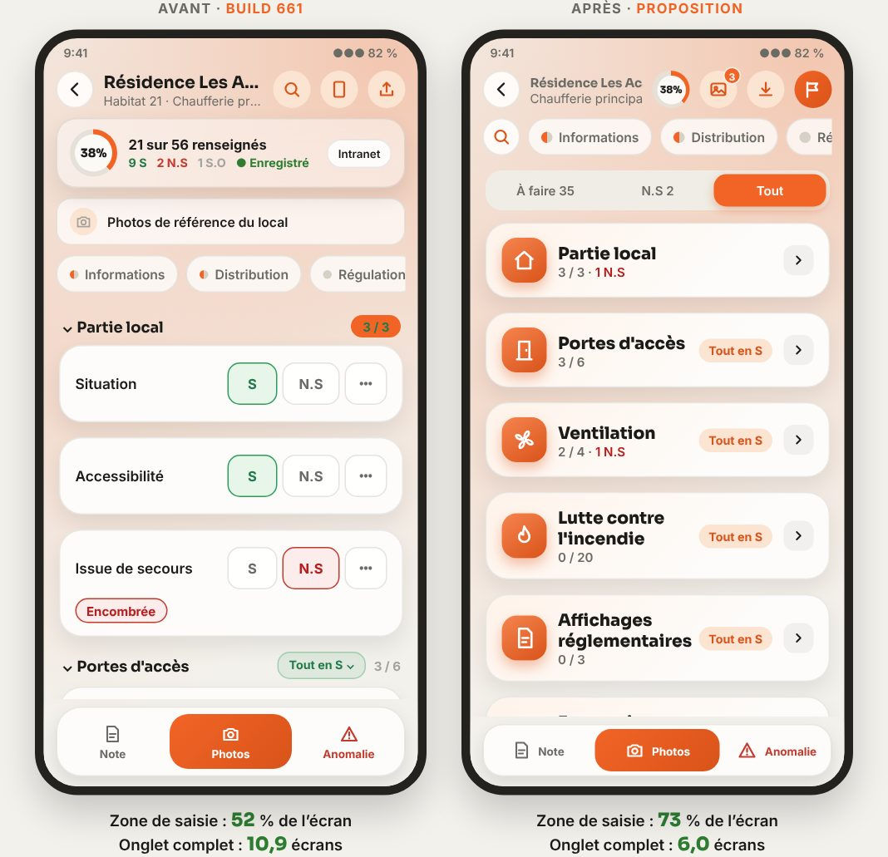
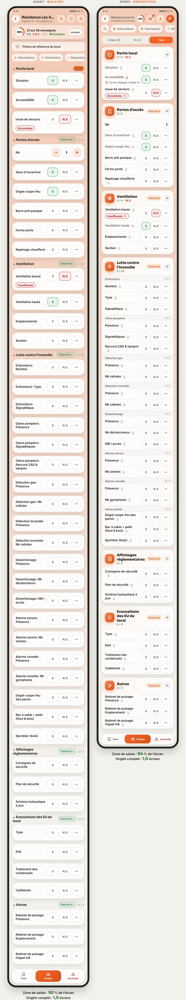
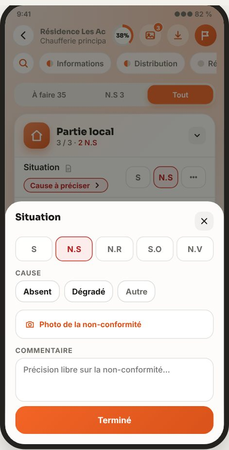
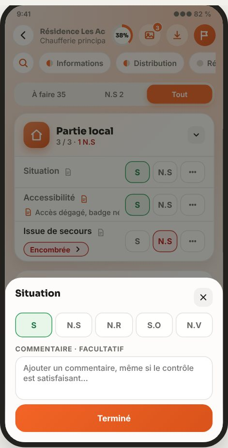

Autres onglets : `05-conformite-energie-*.jpg`, `05-conformite-chauffage-*.jpg`, `05-conformite-ecs-*.jpg`, `05-conformite-adoucisseur-*.jpg`.

**Build 661** (`TrameGenericPanel.js`, `PersistentControleGenerique.js`, commits 659 à 661 « conformité compacte + fiche N.S en fenêtre ») : 104 contrôles au total (Local 43 : Partie local 3, Portes d'accès 6 dont un champ « Nb », Ventilation 4, Lutte contre l'incendie 20, Affichages 3, Évacuation des EU 4, Autres 3 ; Énergie ≈ 32 ; Chauffage ≈ 13 ; ECS 16 ; Adoucisseur 4). En-tête de section : chevron, titre, « Tout en S ⌄ » (appui long : S.O, N.S, N.R, N.V ; annulable par toast), « x / y ». Les sections de plus de 12 contrôles sont découpées par préfixe (« Extincteurs: … »). **Chaque contrôle est une carte `formCard` séparée** (padding 16 + marge 14 ≈ 86 px) avec le libellé, les boutons **S / N.S / « … »** (N.R, S.O, N.V derrière « … »), et sous le libellé la **cause en pastille rouge** pour un N.S ; toucher le libellé ouvre une **fiche** en fenêtre (5 avis, commentaire facultatif pour les avis non N.S, causes + réserve éditable + photo pour N.S, `ReserveSeveritySlider`). Causes et prescriptions : `PRESCRIPTIONS` (`data.js`) + `RESERVE_EXTENSIONS` (`reserveExtensions.js`), mapping des sections par `CATEGORIE_SECTION_MAP`. Conf. Local ≈ 11 écrans.

**Proposition validée** :
- **section = carte à bannière** (pictogramme propre à la rubrique, « 12 / 20 · 1 N.S », « Tout en S » dans la bannière avec « Annuler ») ;
- **une ligne de 42 px par contrôle** : libellé, S, N.S, « … », cause rouge sous le libellé ; Conf. Local ≈ 11 → 6 écrans ; aucun contrôle, avis ni réserve retiré ;
- **filtre « À faire / N.S / Tout »** en haut (un filtre actif ouvre les sections concernées) ;
- **sous-groupes** de « Lutte contre l'incendie » avec préfixe en titre (Nombre, Type… sous « Extincteurs ») ;
- **commentaire possible sur tous les avis (S, N.S, N.R, S.O, N.V)** — demande explicite du porteur du projet : icône de note à côté de chaque libellé (orange quand un commentaire existe), texte affiché sous la ligne, champ « Commentaire facultatif » (S, N.R, S.O, N.V) ou « Précision libre » (N.S) dans la fiche ; la fiche **ne se ferme plus** quand on change d'avis ;
- **fiche N.S** : avis, cause (crée la réserve avec prestation, prix, délai modifiables), photo — comportement inchangé ;
- **tout fermé au départ** ;
- les cinq onglets suivent la même structure.
**Questions ouvertes** : sous-groupes fermés quand on ouvre une section ? démarrage sur « Tout » ou « À faire » ? « Tout en S » : confirmation ou « Annuler » suffit ? **commentaire positif suggéré en un geste pour les S** (règle n°5 d'`AGENTS.md`) : textes à définir — non trouvés dans le code pour ces contrôles (existent pour d'autres trames via `PresetControleGenerique` / `libelleApplicationAvis`) ; champs « Nb » en ligne avec − / + ? **Impact code / attention** : un seul `SectionList` virtualisé à conserver (rows plus légères) ; `avisEnMasse`, `upsertControlePartiel` inchangés ; le commentaire existe déjà en base (`controles.commentaire`) pour tout avis ; `visitTabStatusDb.js` / `visitProgressDb.js` (compteurs) à ne pas casser ; en Réseau de chaleur, `defaultPerimetreForControle` / `isForcedPrimaryControle` (périmètre automatique des réserves) à préserver.

### 5.6 Équipements

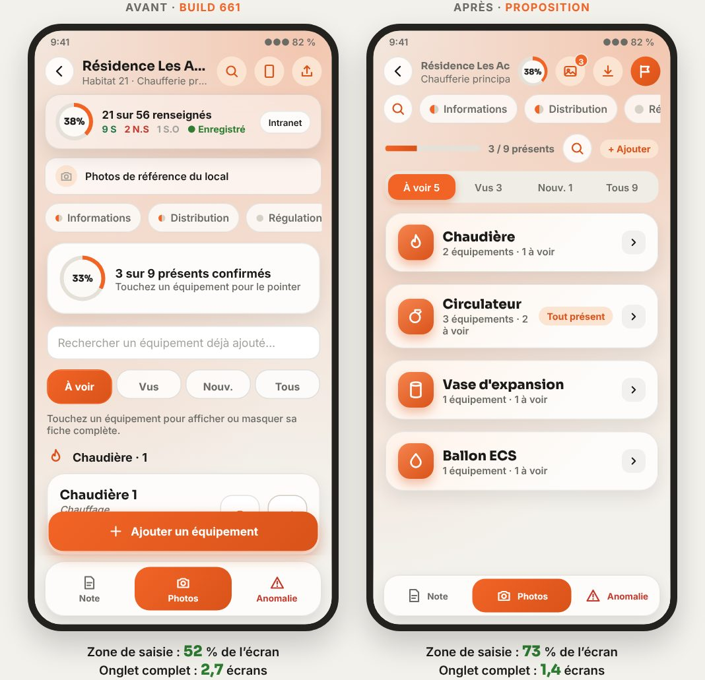
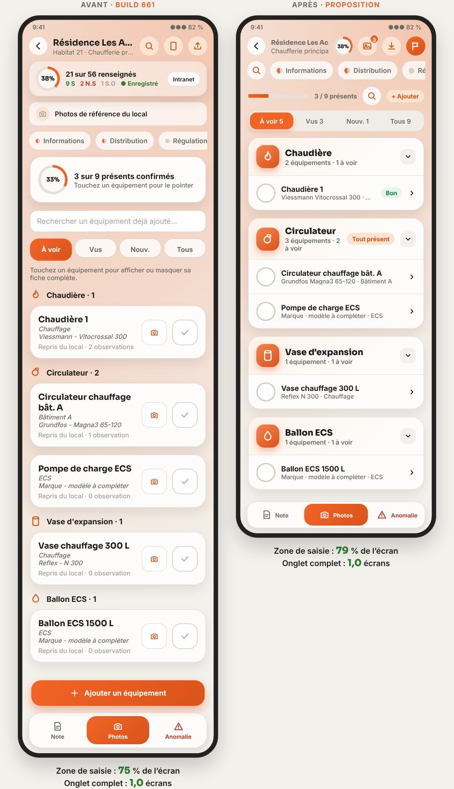
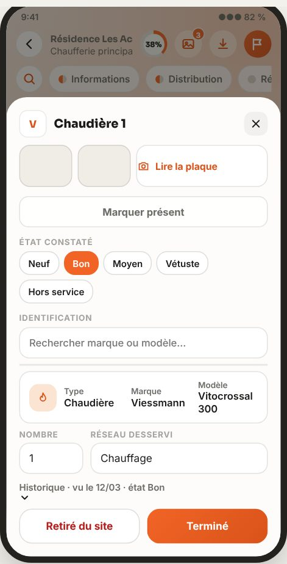
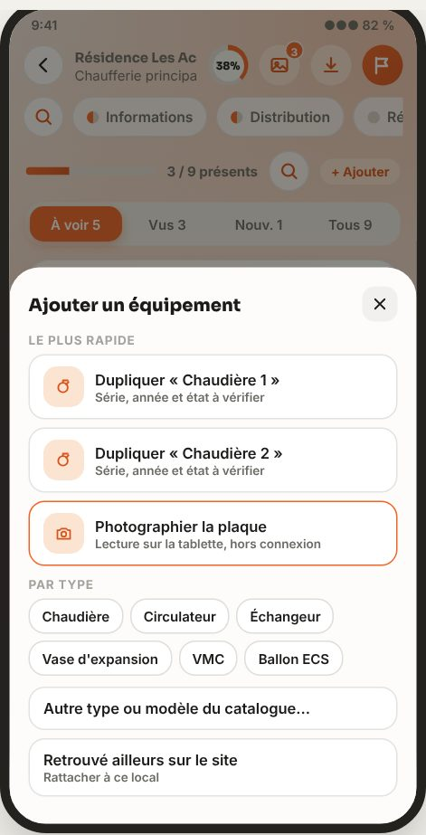

**Build 661** (`GuidedEquipmentPanel.js`, `terrainVisitDb.js`, `persistentEquipmentDb.js`) : en-tête (jauge + texte, recherche, filtres **À voir / Vus / Nouv. / Tous**, phrase d'aide), équipements **groupés par type** (`categorie`), une carte par équipement (désignation, réseau desservi, « marque - modèle », statut « Repris du local · n observations » / « Présence confirmée », **bouton photo + bouton « présent » de 48 px**), fiche en fenêtre (photos, **« État constaté pendant cette visite » (5 valeurs)**, puis « Détails » : **1 Type → 2 Désignation → 3 Marque → 4 Modèle** par sélecteurs en cascade (`PickerSheet`, catalogue VMC/CTA/…), Nombre, Réseau desservi, Caractéristiques, Périmètre Primaire/Secondaire obligatoire en Réseau de chaleur, **« 5. État constaté » (7 valeurs)**, historique, « Retiré du site » avec confirmation), **gros bouton flottant « Ajouter un équipement »** (empilé avec la barre Note/Photos/Anomalie), fenêtre d'ajout (dupliquer l'un des 3 premiers, photographier la plaque, par type, catalogue, « retrouvé ailleurs sur le site »).

**Défauts** : l'**état constaté apparaît deux fois** dans la fiche avec des listes différentes (les valeurs « À surveiller », « Dégradé » sont refusées par l'Intranet) ; le bouton flottant se superpose à la barre du bas ; `PickerSheet`/`PickerField` utilisent les glyphes « ✕ » et « ⌄ » (contraire au système de design).

**Proposition validée** : **une ligne par équipement (≈ 54 px)** : rond de présence à gauche (un toucher marque présent, un second annule), nom, marque modèle · réseau, pastille d'état (Bon, Moyen…) ou « Nouveau » ; **« Tout présent » par type** avec « Annuler » ; **groupes par type fermés au départ** avec « n équipements · m à voir » et pictogramme par type ; **en-tête condensé** (progression, filtres, recherche en icône, « + Ajouter ») sans bouton flottant ; **fiche simplifiée** : photos + **« Lire la plaque »** en premier, présence, **un seul état constaté** (valeurs acceptées par l'Intranet : Neuf, Bon, Moyen, Vétuste, Hors service), **recherche unique marque + modèle** dans le catalogue (remplit aussi le type) à la place des trois sélecteurs, Désignation, Nombre, Réseau desservi, historique replié, « Retiré du site » avec confirmation ; ajout inchangé sur le fond. 2,7 → 1,4 écrans. Photo déplacée de la ligne vers la fiche (*à confirmer*).
**Questions ouvertes** : photo sur la ligne ou dans la fiche ? « Tout présent » sûr ou pointage unitaire seulement ? classement par type ou par réseau ? Primaire / Secondaire visible sur la ligne en Réseau de chaleur ? **Impact code** : `GuidedEquipmentPanel.js`, `EquipmentCatalogueBrowser.js`, `etatPointageEquipement` (`terrainVisitModel.js`), `confirmerEquipementVisite` (en Réseau de chaleur le périmètre est exigé avant confirmation : `Choisis Primaire ou Secondaire…`) — la coche « Tout présent » doit respecter cette règle.

### 5.7 Réserves

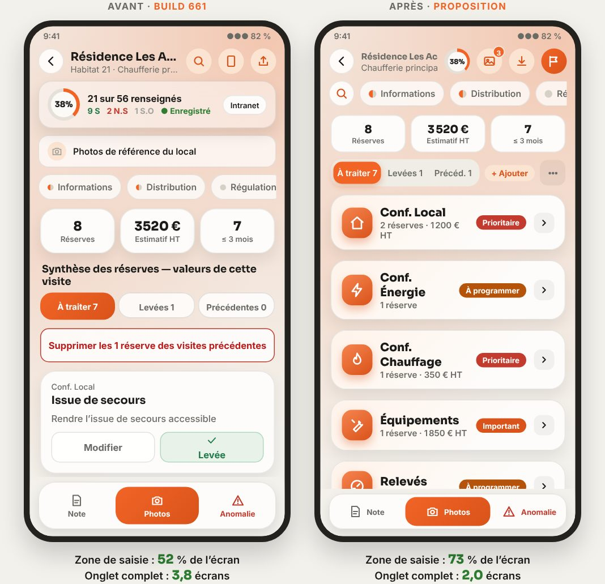
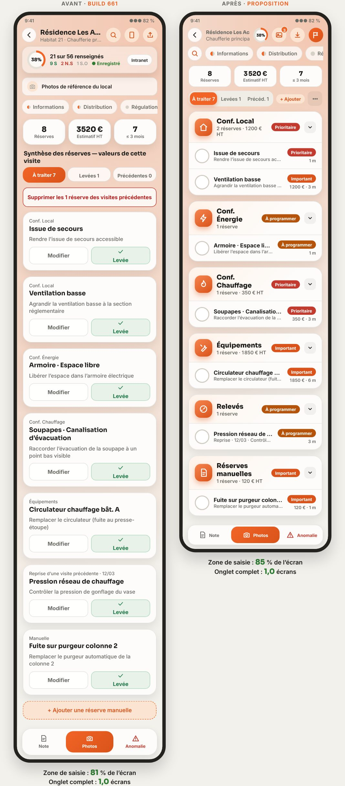
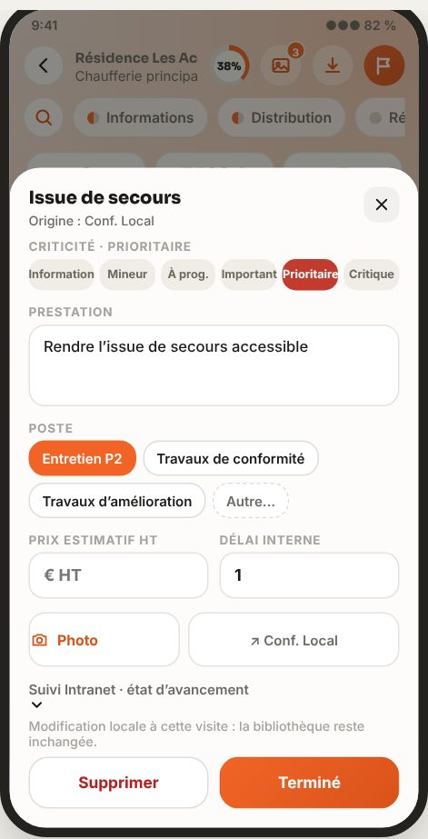
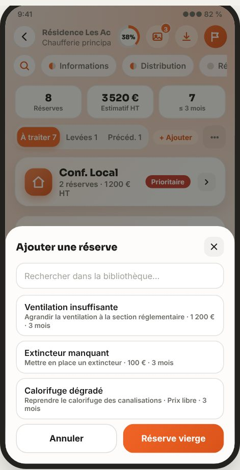

**Build 661** (`OptimizedRemarksPanel.js`, `remarkDb.js`, `reserveSeverity.js`) : trois cartes de totaux (Réserves, Estimatif HT, ≤ 3 mois), titre « Synthèse des réserves — valeurs de cette visite », filtres **À traiter / Levées / Précédentes**, **bouton rouge « Supprimer les N réserves des visites précédentes »** (retrait durable : marque `reserve_lignee` / `retrait_visite` dans `provenances`, `supprimerReservesReprises`), cartes (origine ou « Reprise d'une visite précédente · date », titre, **prestation en entier**, boutons « Modifier » et « Levée » = état d'avancement « Terminé »). « Modifier » déplie un long formulaire dans la liste : photo, Supprimer, Prestation, Poste, [Périmètre en RC], `ReserveSeveritySlider` (6 niveaux : Information, Mineur, À programmer, Important, Prioritaire, Critique), Prix HT, Délai, bloc « Suivi Intranet » (date réserve, échéance, 5 états d'avancement), origine, notice, lien de rattachement à un onglet / élément. Pied : « + Ajouter une réserve manuelle » (bibliothèque ou vierge, puis rattachement).

**Proposition validée** : **regroupement par onglet d'origine, fermé au départ** (« Conf. Local · 2 réserves · 1 200 € HT » + criticité la plus haute ; groupe « Réserves manuelles ») ; **une ligne par réserve (≈ 54 px)** (rond de levée, titre, début de prestation, pastille de criticité colorée, prix et délai), tri par criticité ; **fiche en fenêtre** (criticité en 6 pastilles colorées, prestation, poste en choix + « Autre… », prix, délai, photo, rattachement, suivi Intranet replié, suppression avec confirmation) ; **totaux sur une ligne**, recalculés en direct ; **« Supprimer les réserves des visites précédentes » dans le menu « ⋯ »** avec confirmation et « Annuler » ; « + Ajouter » dans l'en-tête (recherche dans la bibliothèque ou « Réserve vierge » puis fiche). 3,8 → 2,0 écrans.
**Questions ouvertes** : regroupement par onglet, criticité ou poste ? rond de levée avec confirmation ou annulable ? suivi Intranet utilisé sur le terrain ? Primaire / Secondaire comme second regroupement (RC) ? **Impact code** : `OptimizedRemarksPanel.js` ; conserver `perimetre` (RC), `reference_*` (rattachement), `criticite` / `criticite_modifiee`, les règles de reprise (`copyUnresolvedReserves`, test `test_reserve_retrait.js`).

### 5.8 Photos

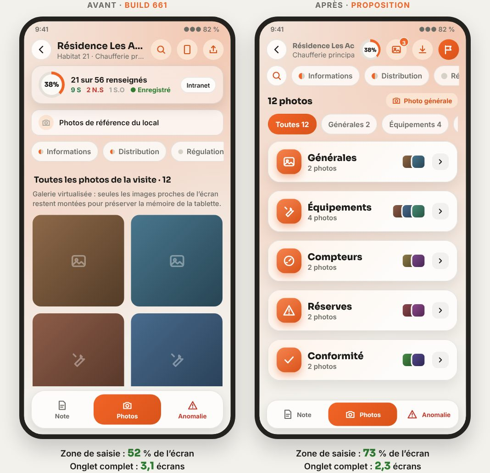
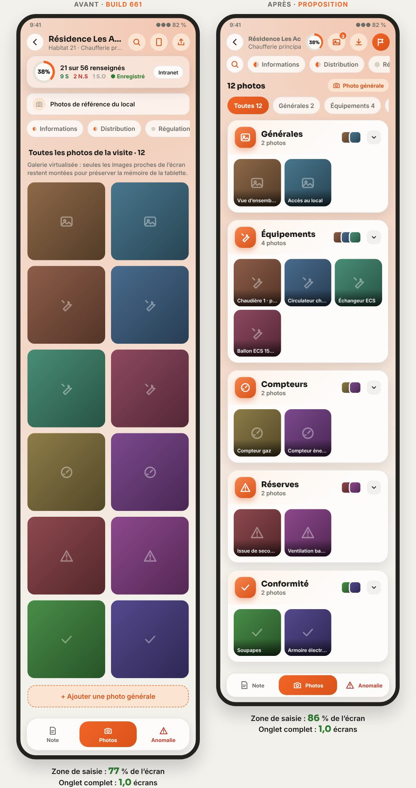
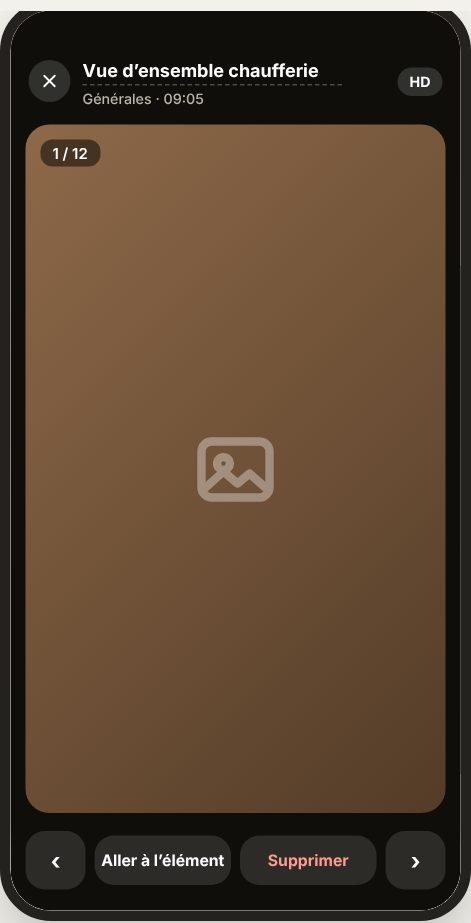

**Build 661** (`OptimizedPhotoPanel.js`, `PhotoButton.js`, `photoRuntimeCache.js`) : titre « Toutes les photos de la visite · N » suivi d'un **texte technique visible** (« Galerie virtualisée : seules les images proches de l'écran restent montées pour préserver la mémoire de la tablette »), grille de **2 colonnes** de vignettes carrées **sans légende** (photos des équipements, compteurs, réserves, contrôles mélangées ; la légende `photo.label` existe mais n'est pas affichée), visionneuse (aperçu / HD, « Supprimer » confirmé, « Fermer », sans navigation), « + Ajouter une photo générale ».

**Proposition validée** : texte technique remplacé par le nombre de photos et des **filtres par origine** (Générales, Équipements, Compteurs, Réserves, Conformité) ; **légende sur chaque vignette** ; **groupes par origine fermés au départ** avec trois vignettes dans la bannière ; **trois colonnes** (≈ 50 % de photos en plus par rangée) ; **visionneuse** : légende modifiable, précédente / suivante, **« Aller à l'élément »**, HD, suppression confirmée puis « Annuler » ; « Photo générale » en tête d'onglet ; Mode Photo de la barre du bas inchangé. 3,1 → 2,3 écrans.
**Questions ouvertes** : regroupement par origine ou galerie unique triée par heure ? sélection multiple ? « Aller à l'élément » utile ? légende dans les exports et le rapport ? **Impact code** : `OptimizedPhotoPanel.js` ; l'origine se déduit de `entite_key` (`equipement||`, `compteur||`, `reseau||`, `remarque||`, clé de contrôle, `null` = générale) ; `supprimerPhotoComplete` + annulation (réinsertion) ; conserver le pré-chargement caméra et le journal d'attente (`photoPersistenceJournal`).

---

## 6. Lecture photo des index (OCR) : diagnostic et plan


**Signalement du porteur du projet** : « j'ai testé l'OCR et ça ne fonctionnait pas bien, l'OCR ne prenait pas l'index mais les autres infos du compteur ». Décision : **traiter après la fin des maquettes** (non encore fait).

**Fonctionnement actuel** : `LecturePhotoButton` (`PhotoOcrReview.js`) → `reconnaitreTexteImageLocale` (`missionNativeTools.js`) → module natif `MetraOcr.recognize` (`native/metra-mission-tools/MetraOcrModule.kt`, **ML Kit Text Recognition latin**, hors connexion) qui renvoie le **texte complet** et des **blocs avec boîtes englobantes** → `extraireValeurOcr(text, {kind, unit, label})` (`photoModeData.js`) qui note chaque nombre du texte et garde le meilleur.
Notation (kind `meter`/`meters`) : +2 par mot du libellé présent sur la ligne ; +2 si ≥ 4 chiffres, +1 si ≥ 6 ; +4 si ≥ 4 chiffres ; **+4 si la ligne contient m³, kWh, MWh ou Wh** ; −5 si 4 chiffres entre 1900 et 2100 (année) ; −5 si négatif ; seuil mini 3 ; à égalité, **le nombre le plus long gagne**.

**Causes probables** (hypothèses tirées du code ; photos non vues) :
1. numéro de série (8 à 10 chiffres), « Qn 2,5 m³/h », numéros de certification ou de modèle marquent plus qu'un index à 5 chiffres (longueur + unité sur la ligne + mot du libellé « compteur » / « gaz ») ;
2. toute la photo est analysée : les **boîtes englobantes ne sont pas utilisées** pour repérer la zone de l'index ;
3. ML Kit lit mal les **tambours mécaniques** (chiffres rouges / noirs, reflets) : l'index peut être absent du texte, il ne reste que la plaque ;
4. aucun guidage à la prise de vue pour les compteurs (cadre seulement pour la plaque signalétique).

**Plan proposé** : (a) **cadre guidé** « cadrez uniquement les chiffres de l'index » et **recadrage avant lecture** (ML Kit ne voit que la zone) ; (b) **règles de tri plus strictes** : écarter lignes N°, S/N, série, Qn, DN, PN, classe, année, nombres ≥ 9 chiffres ou collés à des lettres ; favoriser 4 à 8 chiffres avec ou sans décimales, de grande taille et proches du centre (hauteur du bloc) ; (c) **candidats cliquables** dans la vérification, les autres repères grisés et jamais appliqués d'office ; (d) saisie manuelle toujours disponible ; (e) rester **local / hors connexion** (règle n°7). **Pour régler et tester sans deviner** : 5 à 10 photos de compteurs (gaz, eau, énergie) avec le « texte brut lu » de la fenêtre de vérification, à transformer en jeu de tests (fixtures) pour `extraireValeurOcr`. **Tests** : étendre `.github/scripts/check_phone_photo_mode_contract.js` et ajouter un test de régression sur les textes bruts.

---

## 7. Pictogrammes

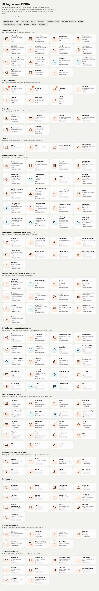

**Demande** : revoir l'ensemble des pictogrammes pour tous les onglets et toutes les trames, « différents et très personnalisés pour chaque ». **Livré** : un jeu de **151 pictogrammes** dessinés sur une grille de 24, trait 1,7, **encre pour la forme + accent orange pour l'élément qui parle, bleu-vert pour l'eau**. Chacun est exporté en SVG autonome (`pictos/<famille>/<nom>.svg`), avec `pictos/index.json` (nom, usage, trames, fichier) et `pictos/INDEX.md` (tableau illustré). Validé par le porteur du projet (« Très très bien tout ça »). *Quelques dessins sont à retravailler à petite taille (par exemple « Entretien P2 », la clé) — le porteur du projet n'a pas encore désigné lesquels.*

| Famille | Nb | Contenu |
|---|---|---|
| `onglets` | 15 | Informations (4 variantes : flamme ICPE, réseau RC, ventilateur VMC, soleil Pré-allumage), Distribution, Régulation, Relevés, Conf. Local / Énergie / Chauffage / ECS / Adoucisseur, Équipements, Réserves, Photos |
| `vmc` | 7 | Caisson 1 à 3 (pastille de numéro, jusqu'à 6), Situation, Caisson, Distribution, Gestion |
| `pa` | 6 | Installations, Compteurs, Régulation, Chaufferie, Sous-stations, Conclusion |
| `trames` | 4 | ICPE, VMC, Réseau de chaleur, Pré-allumage |
| `conf` | 20 | rubriques de conformité (Partie local, Portes, Ventilation, Incendie, Affichages, Évacuation, Autres, Coupure combustible, Coupure électrique, Ligne gaz, Armoire, BAES, Disconnexion chauffage, Traitement d'eau, Conduits de fumées, Soupapes, Disconnexion ECS, Traitement ECS, Ballon et points de contrôle, Réseau(x) alimenté(s)) |
| `inc` | 9 | extincteurs, gaine pompiers, détection gaz, détection incendie, désenfumage, alarme sonore, alarme visuelle, bac à sable, sprinkler |
| `dist` | 13 | distribution chauffage / ECS, réseau, organes, émission, isolation, pompe, cascade chaudières, réseaux, réseau ECS, T° extérieure / départ / retour |
| `rel` | 20 | pressions, compteurs, températures et pH, 12 types de compteur et manomètres, températures par circuit, pH |
| `eq` | 19 | types d'équipement (chaudière, circulateur, pompe, échangeur, vase, ballon ECS, adoucisseur, armoire, compteur, manomètre, soupape, vanne, détendeur, filtre, désemboueur, VMC, CTA, ventilateur, tourelle) |
| `eqs` | 8 | présent, à voir, nouveau, neuf, bon, moyen, vétuste, hors service |
| `res` | 13 | criticité 0 à 5, 3 postes, levée, reprise, Primaire, Secondaire |
| `ph` | 7 | origines de photo (générale, équipement, compteur, réserve, conformité, plaque, Mode Photo) |
| `act` | 10 | rechercher, compagnon, photos de référence, télécharger, terminer, note, anomalie, synchronisation, enregistré, hors connexion |

**Intégration** : `MetraCvcIcons.js` fonctionne par clés (`CvcIcon name="…"`). Les SVG de `pictos/` sont à convertir en chemins `react-native-svg` ; les clés existantes (`flame`, `drop`, `fan`, `thermometer`, `gauge`, `meter`, `tank`, `distribution`, `depart`, `retour`, `pressure`, `tools`, `equipment`, `network`, `regulation`, `plate`, `note`, `camera`, `warning`, `check`, `export`, `download`, `search`…) servent de base ; ajouter les nouvelles et garder la règle « jamais de glyphe texte ». La teinte bleu-vert (`#0F7C8C`) est une exception à l'accent orange à valider dans `DESIGN_SYSTEM.md`. Liste complète et usages : `pictos/INDEX.md`.

---

## 8. Défauts relevés dans le build 661

| # | Écran | Défaut | Fichier |
|---|---|---|---|
| 1 | Régulation | « Retirer » supprime un réseau et ses valeurs **sans confirmation** | `OptimizedRegulationPanel.js` (`ReseauCard`, `remove`) |
| 2 | Régulation, Relevés, Informations | un stepper vide démarre à 0 : 60 appuis pour 60 °C | `GenericFields.js` (`StepperNumerique`) |
| 3 | Équipements | « État constaté » **affiché deux fois** (5 valeurs puis 7), valeurs « À surveiller » / « Dégradé » refusées par l'Intranet | `GuidedEquipmentPanel.js` |
| 4 | Équipements | bouton flottant « Ajouter un équipement » empilé avec la barre du bas ; `paddingBottom: 200` | `GuidedEquipmentPanel.js` |
| 5 | Équipements, Réserves | glyphes texte « ✕ », « ⌄ », « ↗ », « + » à la place d'icônes (contraire à `DESIGN_SYSTEM.md`) | `GuidedEquipmentPanel.js`, `OptimizedRemarksPanel.js` |
| 6 | Photos | **texte technique** affiché à l'utilisateur | `OptimizedPhotoPanel.js` |
| 7 | Photos | grille sans légende, photos de toutes origines mélangées | `OptimizedPhotoPanel.js` |
| 8 | Conformité | une carte par contrôle (≈ 86 px) | `TrameGenericPanel.js` (`styleCarteChamp`) |
| 9 | Coque | « Terminer » représenté par l'icône d'export | `VisiteScreen.js` |
| 10 | Coque | carte d'avancement réductible sans indice visible | `VisiteScreen.js` (`heroMini`) |
| 11 | Réserves | bouton rouge « Supprimer les réserves précédentes » très visible pour une action rare | `OptimizedRemarksPanel.js` |
| 12 | Réserves | prestation affichée en entier dans la liste, deux boutons par carte | `OptimizedRemarksPanel.js` |
| 13 | Relevés | OCR : prend d'autres nombres que l'index (§6) | `photoModeData.js`, `PhotoOcrReview.js` |
| 14 | Informations (ICPE) | doublons probables « Nom du site » / date de visite — **à confirmer** | `data.js` (`p-infos`) |

---

## 9. Plan de mise en œuvre proposé

*(proposition ; rien n'est lancé — à valider avant de commencer)*

**Cadre imposé par `AGENTS.md`** : branche dédiée par lot, **PR vers `native-android`**, rôle principal identifié dans `agents/` (`android-ui.md` pour l'interface), impacts à vérifier sur ICPE, VMC, **Réseau de chaleur** et Pré-allumage, SQLite / Excel / PDF-Word / Android natif, matrice de `agents/qa.md` (conclusion **VALIDÉ** ou **BLOQUÉ**), bundle JS **et** compilation Android (règle n°12), aucun patch dans `postinstall`/CI (règle n°13), mise à jour de `docs/DESIGN_SYSTEM.md`.

| Lot | Contenu | Écrans | Risque |
|---|---|---|---|
| 0 | **Socle de composants** : `SectionBanner` (repliable, pastille d'icône, avancement, action), `ChoiceField` (choix qui se replie sur la valeur, multi-choix avec OK), `ValueTile` (tuile − / + avec valeur de départ), `FilterSeg`, `BottomSheet`, `ConfirmStrip` + `UndoToast`, `InlineRename`, `UnitPicker`, tuiles de photo ; **jeu de pictogrammes** dans `MetraCvcIcons.js` | tous | faible, mais base de tout |
| 1 | **Coque** : en-tête en pictogrammes, jauge + feuille d'état, titre défilant, rail avec recherche | 0 | moyen (`VisiteScreen.js` est central : pager, swipe, tablette, « onglets en bas ») |
| 2 | **Conformité** (gain maximal : 11 → 6 écrans) : bannières, lignes, filtre, commentaire sur tous les avis, tout fermé | 5 | moyen (`TrameGenericPanel`, `PersistentControleGenerique`, comptage de progression, périmètre RC) |
| 3 | **Relevés** : compteurs sur deux lignes, unités, renommage, températures par circuit + ajout, ΔT | 4 | élevé (Excel, `destination`, points de mesure, trame RC) |
| 4 | **Distribution, Régulation, Informations** : choix repliables, groupes, tuiles, réseaux repliables, Dupliquer, confirmation de suppression | 1, 2, 3 | moyen |
| 5 | **Équipements** : lignes, pointage, fiche simplifiée, recherche catalogue | 6 | moyen (catalogue, règle RC du périmètre, état Intranet) |
| 6 | **Réserves** : groupes, lignes, fiche, menu | 7 | moyen (reprise des réserves, Intranet) |
| 7 | **Photos** : groupes, légendes, visionneuse | 8 | faible à moyen (mémoire, journal photo) |
| OCR | **Lecture photo des index** (cadre guidé, tri, candidats, tests sur photos réelles) | 4 | à traiter à part, avec jeu de photos |

**Points transverses** : les clés de champs, de contrôles et de sections **ne changent pas** (maillage sémantique, import / export Excel, Intranet, reprise de visite) ; seules la présentation et quelques comportements changent. Renommages = alias d'affichage (modèle `preAllumageAliases.js` / `destination` des compteurs). Les états « repliés / dépliés » sont des états d'interface (mémoire de session comme `repliesParPanneau`, éventuellement persistés par visite). Vérifier le swipe de pager (`PanResponder`) contre les nouveaux gestes (les curseurs captent déjà leurs gestes). Respecter « jamais d'`elevation` sur fond translucide ». Tests existants à adapter : `.github/scripts/check_phone_photo_mode_contract.js`, `test_terrain_visit_ui.js`, `test_reserve_retrait.js` ; nouveaux tests à écrire pour le tri OCR, la reprise de valeurs avec choix repliés, le commentaire sur tout avis, la confirmation de suppression de réseau.

---

## 10. Journal des échanges et décisions

1. **Demande initiale** : regarder l'APK 661 et revoir les onglets des parties visites, écran par écran, en échangeant. → Analyse du build (run 661, commit `8c8cbaf`) ; la branche locale a dû être repositionnée sur ce commit (le dépôt local était très en retard).
2. **Nom du site et du local, visuel** : « Peux-tu me générer de l'HTML pour qu'on puisse suivre visuellement ? Qu'est-ce qui est le mieux pour ne pas gaspiller de tokens ? » → Choix : **une seule page de maquettes** mise à jour à chaque écran, avec les couleurs du dépôt.
3. **Priorités** : gain de hauteur, simplification premium sans perdre la modification, accélérer la saisie.
4. **Écran 0/1 — retours** : « Terminer » → pictogramme, avec un pictogramme télécharger ; jauge cliquable avec état et nombre de S, N.S, etc. ; pictogramme pour contrôler les photos de référence. → appliqué.
5. **Écran 0/1/2 — retours** : voir le nom du site et du local (plus petit ou défilant) ; Distribution plus premium avec pictogrammes par sections ; le fond réel de l'application est « en verre opaque » → maquette alignée sur le code des couleurs ; **dès qu'un paramètre est choisi, il se referme sur la valeur (orange ou bleu), on peut le rouvrir pour désélectionner ou changer** → appliqué et rendu interactif.
6. **Régulation** : validée.
7. **Relevés — retours** : renommer tous les noms de compteurs, pareil pour les températures, **ajouter des températures de chauffage et d'ECS** ; « Très bien pour les consommations » ; **OCR défaillant** (prend les autres informations) → à traiter après les maquettes ; **pour tous les onglets**, cliquer sur le nom d'une section la réduit / la développe ; **cliquer sur une unité permet de la modifier, pareil pour les noms** → appliqué partout.
8. **Conformité — retours** : **commentaire possible même si S, S.O, etc.** ; **tout fermé de base**, ouverture manuelle → appliqué (et étendu à tous les onglets).
9. **Équipements, Réserves, Photos** : validés (« Très bien », « Top »).
10. **Pictogrammes** : « revoir l'ensemble des pictogrammes pour tous les onglets et toutes les trames, différents et très personnalisés ; montre juste les pictogrammes et à quoi ils sont associés » → catalogue de 151 pictogrammes ; validé (« Très très bien tout ça »).
11. **Sauvegarde** : « sauvegarde tout en faisant un document ultra complet… » → ce dossier.

---

## 11. Questions encore ouvertes

**Écran 1 Informations** : confirmer les doublons « Général » / « Informations générales » sur l'APK ; quels champs en choix rapides ; champs jamais remplis sur le terrain.
**Écran 0 Coque** : compteurs S / N.S / S.O visibles en permanence ou seulement au toucher de la jauge ; onglets en haut ou en bas ; le drapeau pour « Terminer » ou une coche.
**Écran 2 Distribution** : photos par champ utiles ? points orange « repris » ou neutres ? choix manquants dans les listes ? bleu-vert pour l'ECS (exception à l'accent orange) à valider ? états du calorifuge (Bon / Dégradé / Manquant) à ajuster ? bouton « OK » des choix multiples ou fermeture automatique ?
**Écran 3 Régulation** : valeurs de départ (T°ext, T°dép, courbe, consigne ECS) ; réseaux souvent presque identiques ; programme horaire libre ou cas types.
**Écran 4 Relevés** : ΔT utile ? unité par défaut par type de compteur ? départ de température à 60 °C ou dernière valeur ? renommer sans changer la ligne Excel — confirmé dans le principe, à valider pour les températures ; températures ajoutées : annexe ou ligne du rapport ? températures complémentaires à proposer ; unités des pressions / températures modifiables aussi (non faits : °C et bar fixes) ?
**Écran 5 Conformité** : sous-groupes fermés ? démarrage « Tout » ou « À faire » ? confirmation de « Tout en S » ? **commentaire positif suggéré** (règle n°5) : textes ? champs « Nb » en ligne ?
**Écran 6 Équipements** : photo sur la ligne ou dans la fiche ? « Tout présent » ? par type ou par réseau ? Primaire / Secondaire sur la ligne (RC) ?
**Écran 7 Réserves** : regroupement ? confirmation de la levée ? suivi Intranet sur le terrain ? double regroupement RC ?
**Écran 8 Photos** : regroupement par origine ou galerie unique ? sélection multiple ? « Aller à l'élément » ? légendes dans les exports ?
**Pictogrammes** : lesquels redessiner ; variantes par trame au-delà d'Informations ?
**OCR** : photos de compteurs et « texte brut lu » à fournir ; lancer le lot OCR avant ou après la mise en œuvre des écrans ?

---

## 12. Annexes

### 12.1 Fichiers de ce dossier

| Chemin | Contenu |
|---|---|
| `README.md` | ce document |
| `rapport.html` | ce document en page autonome, images intégrées (réduites) |
| `maquettes/maquettes-visite.html` | **maquettes interactives** des 9 écrans (ouvrir dans un navigateur ; Google Fonts en ligne pour Sora / Inter ; `#coque`, `#infos`, `#d`, `#r`, `#rel`, `#c`, `#e`, `#res`, `#p` dans l'adresse ouvrent un écran) |
| `maquettes/pictogrammes.html` | catalogue interactif des 151 pictogrammes |
| `captures/*.jpg` | captures de chaque écran : `…-defaut` (à l'ouverture), `…-complet` (tout déplié, avant / après), états (fiches, fenêtres, lecture photo, visionneuse), `09-pictogrammes-planche` |
| `pictos/<famille>/*.svg`, `pictos/index.json`, `pictos/INDEX.md` | les 151 pictogrammes en SVG autonomes et leur index |
| `donnees/conformite-trame-icpe.json` | les 104 contrôles de conformité (sections, champs / contrôles) de la trame ICPE, extraits de `data.js` |
| `outils/generer_captures.cjs`, `outils/generer_pictos.cjs`, `outils/construire_rapport.py` | scripts de régénération |

### 12.2 Régénérer captures, pictogrammes et rapport

```bash
cd docs/refonte-visite-661/outils
NODE_PATH=$(npm root -g) node generer_captures.cjs   # captures/*.jpg (Chromium Playwright)
NODE_PATH=$(npm root -g) node generer_pictos.cjs     # pictos/ + planche
python3 construire_rapport.py                        # rapport.html (images intégrées)
```

### 12.3 Rappels techniques utiles à la mise en œuvre

- **Registre des trames** : `trameRegistry.js` (ICPE, VMC, Réseau de chaleur, Pré-allumage ; `ui.panels`, `ui.tabOrder`, `ui.labels`, `excel.fieldMappings`, `networks`, `tables`, `heatNetwork`).
- **Panneaux spéciaux** : `p-regulation`, `p-releves`, `p-equip`, `p-remarques`, `p-photos` (rendus par `VisitPanelHost` dans `VisiteScreen.js`) ; tous les autres onglets passent par `TrameGenericPanel`.
- **Champs** : `DurableChampGenerique` (autosave durable 450 ms, `useDurableAutosave`) ; contrôles : `PersistentControleGenerique` (ICPE, RC), `PresetControleGenerique`, `VmcControleGenerique`.
- **Statut des onglets** : `visitTabStatusDb.js` (`calculerEtatOnglets`), progression `visitProgressDb.js`.
- **Aliases** : `preAllumageAliases.js` (noms personnalisés Pré-allumage) comme modèle pour le renommage.
- **Photos** : `entite_key` (`equipement||id`, `materiel||id`, `compteur||id`, `compteur_site||id`, `reseau||id`, `reseau_site||id`, `remarque||id`, clé de contrôle `section||cle`), `photoRuntimeCache.js`, `photoPersistenceJournal.js`.
- **Excel** : `excelExport.js` (annexe « points de mesure » ligne 282), `excelImport.js`, `templateExcel*.js`.
- **Intranet** : états d'équipement acceptés : Neuf, Bon, Moyen, Vétuste, Hors service.
- **Direction artistique** : `docs/DESIGN_SYSTEM.md` (à compléter avec : sections repliables à bannière, pictogrammes de rubriques, bleu-vert de l'eau).
- **Politique Context7** (première version d'`AGENTS.md`) : à utiliser seulement pour une API externe incertaine, au plus 5 consultations par tâche.
