# Index des pictogrammes

## Onglets de visite (15)

Les onglets du bandeau en haut de la visite, par trame.

| Fichier | Nom | Usage | Trames |
|---|---|---|---|
|  | Informations | Fiche du site · trame ICPE | ICPE |
|  | Informations | Fiche du site · Réseau de chaleur | RC |
|  | Informations | Fiche du site · VMC | VMC |
|  | Informations | Fiche du site · Pré-allumage | PA |
|  | Distribution | Réseaux de distribution chauffage et ECS | ICPE, RC |
|  | Régulation | Cascade, courbes de chauffe, réseaux | ICPE, RC |
| 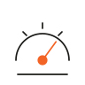 | Relevés | Pressions, compteurs, températures | ICPE, RC |
|  | Conf. Local | Local technique et sécurité | ICPE, RC |
| 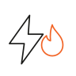 | Conf. Énergie | Coupures, gaz, armoire électrique | ICPE, RC |
|  | Conf. Chauffage | Soupapes, fumées, traitement d'eau | ICPE, RC |
| 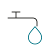 | Conf. ECS | Eau chaude sanitaire | ICPE, RC |
| 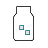 | Conf. Adoucisseur | Réseaux alimentés, sel, bypass | ICPE, RC |
|  | Équipements | Patrimoine du local, pointage | Toutes |
|  | Réserves | Réserves à lever | Toutes |
|  | Photos | Galerie de la visite | Toutes |

## VMC · caissons (7)

Les onglets propres à la trame VMC et les rubriques d'un caisson.

| Fichier | Nom | Usage | Trames |
|---|---|---|---|
|  | Caisson 1 | Un onglet par caisson, jusqu'à 6 | VMC |
|  | Caisson 2 |  | VMC |
|  | Caisson 3 |  | VMC |
|  | Situation | Implantation et accès du caisson | VMC |
|  | Caisson | État du caisson et du ventilateur | VMC |
| 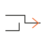 | Distribution | Gaines, bouches, réseau aéraulique | VMC |
|  | Gestion | Pilotage, programmation, maintenance | VMC |

## Pré-allumage (6)

Les onglets propres à la visite de préparation de la saison de chauffe.

| Fichier | Nom | Usage | Trames |
|---|---|---|---|
|  | Installations | Bâtiments, sous-stations, rubriques techniques | PA |
|  | Compteurs | Index de départ de saison | PA |
| 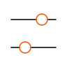 | Régulation | Consignes et réglages par sous-station | PA |
| 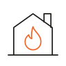 | Chaufferie | Chaudières, brûleurs, pompes | PA |
| 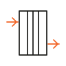 | Sous-stations | Échangeurs et départs | PA |
|  | Conclusion | Contrôles à faire, équipements à remplacer | PA |

## Trames (4)

Une marque par type de visite, pour la liste des visites et la création.

| Fichier | Nom | Usage | Trames |
|---|---|---|---|
|  | ICPE | Chaufferie classée | ICPE |
|  | VMC | Ventilation mécanique | VMC |
|  | Réseau de chaleur | Sous-station et réseau | RC |
| 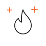 | Pré-allumage | Lancement de la saison de chauffe | PA |

## Conformité · rubriques (20)

Les rubriques des cinq onglets de conformité.

| Fichier | Nom | Usage | Trames |
|---|---|---|---|
|  | Partie local | Situation, accessibilité, issue de secours | ICPE, RC |
|  | Portes d'accès | Sens d'ouverture, coupe-feu, barre anti-panique | ICPE, RC |
|  | Ventilation | Ventilations haute et basse | ICPE, RC |
|  | Lutte contre l'incendie | Extincteurs, détection, désenfumage | ICPE, RC |
|  | Affichages réglementaires | Consignes, plan de sécurité, schéma | ICPE, RC |
|  | Évacuation des eaux | Type, état, condensats, caillebotis | ICPE, RC |
|  | Autres | Rubrique de fin de liste | ICPE, RC |
|  | Coupure combustible | Coup de poing extérieur gaz ou fioul | ICPE, RC |
| 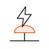 | Coupure électrique | Coup de poing extérieur, séparation F/L/R | ICPE, RC |
|  | Ligne alimentation gaz | Vannes, filtre, pressostats, manomètre | ICPE, RC |
|  | Armoire électrique | Schéma, câblage, protection | ICPE, RC |
|  | BAES | Éclairage de sécurité | ICPE, RC |
|  | Disconnexion · chauffage | Alimentation en eau froide du circuit | ICPE, RC |
|  | Traitement d'eau · chauffage | Filtration, pot d'introduction, produit | ICPE, RC |
| 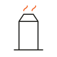 | Conduits de fumées | Type, section, thermomètre | ICPE, RC |
| 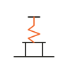 | Soupapes | Évacuation et pression de tarage | ICPE, RC |
| 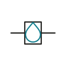 | Disconnexion · ECS | Alimentation en eau froide de l'ECS | ICPE, RC |
|  | Traitement · ECS | Produit, niveau, point d'injection | ICPE, RC |
|  | Ballon et points de contrôle | Manchettes, trou d'homme, carnet sanitaire | ICPE, RC |
|  | Réseau(x) alimenté(s) | Adoucisseur : type, état, sel, bypass | ICPE, RC |

## Lutte contre l'incendie · sous-groupes (9)

Les neuf familles de contrôles regroupées dans la rubrique.

| Fichier | Nom | Usage | Trames |
|---|---|---|---|
|  | Extincteurs | Nombre, type, signalétique | ICPE, RC |
| 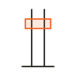 | Gaine pompiers | Présence, raccord, signalétique | ICPE, RC |
|  | Détection gaz | Présence et nombre de cellules | ICPE, RC |
|  | Détection incendie | Présence et nombre de cellules | ICPE, RC |
| 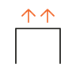 | Désenfumage | Déclencheurs, accès, DM | ICPE, RC |
|  | Alarme sonore | Sirènes | ICPE, RC |
|  | Alarme visuelle | Gyrophares | ICPE, RC |
|  | Bac à sable et pelle | Chaufferies fioul et bois | ICPE, RC |
|  | Sprinkler | Chaufferies bois | ICPE, RC |

## Distribution et régulation · rubriques (13)

Les rubriques des onglets Distribution et Régulation.

| Fichier | Nom | Usage | Trames |
|---|---|---|---|
|  | Distribution chauffage | Réseau de distribution du chauffage | ICPE, RC |
|  | Distribution ECS | Réseau de distribution de l'ECS | ICPE, RC |
|  | Réseau | Matériaux, type de distribution | ICPE, RC |
|  | Organes | Vannes aller et retour, robinetterie | ICPE, RC |
|  | Émission | Radiateurs, planchers, ventilo-convecteurs | ICPE, RC |
|  | Isolation | Calorifuge : type et état | ICPE, RC |
|  | Pompe | Variation de vitesse | ICPE, RC |
|  | Cascade chaudières | Paramètres, T° extérieure, T° départ | ICPE, RC |
|  | Réseaux | Un circuit par réseau | ICPE, RC |
|  | Réseau ECS | Consigne et cycle anti-légionellose | ICPE, RC |
|  | T° extérieure | Point bas de la courbe | ICPE, RC |
|  | T° de départ | Température du départ | ICPE, RC |
|  | T° de retour | Température du retour | ICPE, RC |

## Relevés · compteurs et mesures (20)

Les icônes de l'onglet Relevés : un pictogramme par type de compteur et par mesure.

| Fichier | Nom | Usage | Trames |
|---|---|---|---|
|  | Pressions | Pression chauffage et ECS | ICPE, RC |
|  | Compteurs | Index relevés | ICPE, RC |
|  | Températures et pH | Mesures des circuits | ICPE, RC |
|  | Compteur gaz | Index gaz, cuve fioul | ICPE, RC |
|  | Énergie chauffage | Index MWh | ICPE, RC |
|  | Énergie ECS | Index MWh ECS | ICPE, RC |
|  | Eau d'appoint chauffage | Index m³ | ICPE, RC |
|  | Eau froide ECS | Alimentation EF de l'ECS | ICPE, RC |
|  | Eau froide générale | Compteur d'eau du site | ICPE, RC |
|  | Électricité | Index kWh | ICPE, RC |
|  | Fioul | Cuve, litres ou % | ICPE, RC |
|  | Calories | Compteur d'énergie thermique | ICPE, RC |
|  | Volumétrique | Débit cumulé | ICPE, RC |
|  | Manomètre chauffage | Pression du circuit chauffage | ICPE, RC |
|  | Manomètre ECS | Pression du circuit ECS | ICPE, RC |
| 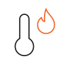 | T° primaire | Circuit primaire | ICPE, RC |
| 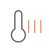 | T° chauffage | Circuit chauffage | ICPE, RC |
|  | T° ECS | Circuit eau chaude | ICPE, RC |
|  | T° de stockage | Ballon ECS | ICPE, RC |
|  | pH | Eau du circuit | ICPE, RC |

## Équipements · types (19)

Un pictogramme par type d'équipement du catalogue, pour les groupes et les fiches.

| Fichier | Nom | Usage | Trames |
|---|---|---|---|
|  | Chaudière |  | ICPE, RC, PA |
|  | Circulateur |  | ICPE, RC, PA |
|  | Pompe |  | ICPE, RC, PA |
|  | Échangeur |  | ICPE, RC, PA |
|  | Vase d'expansion |  | ICPE, RC, PA |
|  | Ballon ECS |  | ICPE, RC |
|  | Adoucisseur |  | ICPE, RC |
| 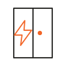 | Armoire électrique |  | ICPE, RC, PA |
|  | Compteur |  | ICPE, RC, PA |
|  | Manomètre |  | ICPE, RC, PA |
|  | Soupape |  | ICPE, RC, PA |
|  | Vanne |  | ICPE, RC, PA |
|  | Détendeur |  | ICPE, RC, PA |
| 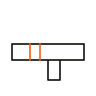 | Filtre |  | ICPE, RC, PA |
|  | Désemboueur |  | ICPE, RC |
|  | VMC |  | VMC |
| 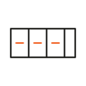 | CTA |  | VMC |
|  | Ventilateur |  | VMC |
| 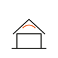 | Tourelle |  | VMC |

## Équipements · statuts et états (8)

Pointage de présence et état constaté, affichés sur les lignes et dans les fiches.

| Fichier | Nom | Usage | Trames |
|---|---|---|---|
|  | Présent | Présence confirmée | Toutes |
|  | À voir | Équipement repris, à pointer | Toutes |
|  | Nouveau | Ajouté pendant la visite | Toutes |
|  | Neuf | État constaté | Toutes |
|  | Bon | État constaté | Toutes |
|  | Moyen | État constaté | Toutes |
| 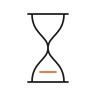 | Vétuste | État constaté | Toutes |
|  | Hors service | État constaté | Toutes |

## Réserves (13)

Criticité, postes de prestation et suivi des réserves.

| Fichier | Nom | Usage | Trames |
|---|---|---|---|
|  | Information | Criticité 0 | Toutes |
|  | Mineur | Criticité 1 | Toutes |
|  | À programmer | Criticité 2 | Toutes |
|  | Important | Criticité 3 | Toutes |
|  | Prioritaire | Criticité 4 | Toutes |
| 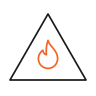 | Critique | Criticité 5 | Toutes |
| 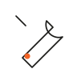 | Entretien P2 | Poste de prestation | Toutes |
|  | Travaux de conformité | Poste de prestation | Toutes |
|  | Travaux d'amélioration | Poste de prestation | Toutes |
|  | Levée | Réserve traitée | Toutes |
|  | Reprise | Réserve d'une visite précédente | Toutes |
|  | Primaire | Périmètre · Réseau de chaleur | RC |
|  | Secondaire | Périmètre · Réseau de chaleur | RC |

## Photos · origines (7)

D'où vient une photo : sert aux groupes et aux légendes de la galerie.

| Fichier | Nom | Usage | Trames |
|---|---|---|---|
|  | Générale | Vue d'ensemble, accès | Toutes |
|  | Équipement | Photo liée à un équipement | Toutes |
|  | Compteur | Photo d'un index | Toutes |
|  | Réserve | Photo d'une non-conformité | Toutes |
|  | Conformité | Photo d'un contrôle | Toutes |
|  | Plaque signalétique | Lecture de plaque | Toutes |
|  | Mode Photo | Saisie rapide terrain | Toutes |

## Actions et états (10)

Boutons du bandeau, de la barre du bas et de la synchronisation.

| Fichier | Nom | Usage | Trames |
|---|---|---|---|
|  | Rechercher | Recherche dans la visite | Toutes |
| 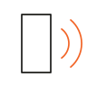 | Compagnon | Téléphone relié à la tablette | Toutes |
|  | Photos de référence | Photos du local de la visite précédente | Toutes |
|  | Télécharger | Exporter l'Excel de la visite | Toutes |
|  | Terminer | Aperçu, signature, export | Toutes |
|  | Note | Note libre | Toutes |
|  | Anomalie | Ajouter une anomalie, une réserve | Toutes |
|  | Synchronisation | Envoi vers l'Intranet | Toutes |
|  | Enregistré | Sauvegarde terminée | Toutes |
| 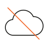 | Hors connexion | Données gardées sur la tablette | Toutes |

